# 3121 Notes

## General Info

**Lecturer**: Aleksandar Ignjatovic  
**Course email**: cs3121@cse.unsw.edu.au  
**Lab tutorial times**: https://timetable.unsw.edu.au/2024/COMP3121.html#S2S

https://www.bigocheatsheet.com/  
https://haezera.github.io/#/resources

### Modules
1. Foundations (week 1)
2. Divide and conquer (week 2 - 3)
3. Greedy algorithms (weeks 4 – 5)
4. Flow networks (week 5 - 7)
5. Dynamic programming (weeks 7 – 9)
6. Intractable problems (weeks 9 – 10)

## Algorithms
An algorithm is a **sequence of precisely defined steps** that can be executed mechanically.

**Sequential Algorithms**
- Comprised by a sequence of steps, which can only be **executed one at a time.**

**Deterministic Algorithms**
- Each step always gives the same result for the same input

## Efficiency 
Measure the efficiency of algorithms using **asymptotic analysis**.
- we are concerned with the **worst case** performance, however average performance sometimes accepted (quicksort)

### Big-Oh
$f(n) = O(g(n))$ if for large enough $n$, $f(n)$ is at most a constant multiple of $g(n)$.

- $g(n)$ is said to be an asymptotic upper bound for $f(n)$

### Big-Omega
$f(n) = Ω(g(n))$ if for large enough $n$, $f(n)$ is at least a constant multiple of $g(n)$.

- $g(n)$ is said to be an asymptotic lower bound for $f(n)$

### Big-Theta
$f(n) = Θ(g(n))$ if $f(n)$ is equal to $g(n)$.
- Only true if $f(n) = O(g(n))$ and $f(n) = Ω(g(n))$.

### Summary

### Sum property 
If $f_1 = O(g_1)$ and $f_2 = O(g_2)$, then $f_1 + f_2 = O(g_1+g_2)$

### Product property
If $f_1 = O(g_1)$ and $f_2 = O(g_2)$ ,then $f_1 \cdot f_2 = O(g_1 \cdot g_2)$

## (Binary) Heaps
- Max heap, parent $\geq$ children
- Min heap, parent $\leq$ children
- Used to implement priority queue

#### Performance
- Build heap: $O(n)$
- Find maximum: $O(1)$
- Delete maximum: $O(log n)$
- Insert: $O(log n)$

Parent at index `i`, children index `2i, 2i + 1`

## Binary Search Tree
Each node’s value $\geq$ all values in left subtree, and $\leq$ all keys in right subtree.

#### Performance
Let h be the height of tree
- Build heap: $O(h)$
- Insert/delete: $O(h)$

### Self Balancing BST
- Perform rotations to ensure $h = O(log(n))$
- All operations:  $O(log(n))$

## Hash Tables
- Store **values** indexed by **keys**.
- Hash function maps keys to indices in a fixed size table.
- Ideally no two keys map to the same index.

#### Performance (expected)
- Search for value associated to key: $O(1)$
- Update value associated to key: $O(1)$
- Insert/delete: $O(1)$
  
#### Performance (worst case)
- Search for value associated to key: $O(n)$
- Update value associated to key: $O(n)$
- Insert/delete: $O(n)$

## Reasoning about algorithms
Whenever we present an algorithm, we must justify its **correctness** and **efficiency**.

## Gale-Shapley algorithm
**1-foundation-short.pdf**:  slides 40 - 55

- The algorithm terminates after $\leq n_2$ rounds.
- The algorithm produces a perfect matching, everyone belongs to exactly one pair.
- The matching produced by the algorithm is stable.

# Divide and Conquer
- This method is called **divide-and-conquer** to develop algorithms
- Examples: binary search, merge sort and quicksort.

## Binary Search
- **Divide**: Test the midpoint of the search range $Θ(1)$  
- **Conquer**: Search one side of the midpoint recursively  
- **Combine**: Pass the answer up the recursion tree $(Θ(1))$
- **Recursion** is $log_2n$ levels deep, with a total of $Θ(1)$ time spent in each level.

Time complexity is $Θ(log n)$.

## Merge sort
- **Divide**: Split the array into two equal part $Θ(1)$  
- **Conquer**: Sort each part recursively
- **Combine**: Merge the two sorted subarrays (Θ(n))
- **Recursion** is $log_2n$ levels deep, with a total of $Θ(n)$ time spent in each level.

Time complexity is $Θ(n log n)$.

### Inversions
An inversion is a pair $(i,j)$ such that:
- $i$ < $j$ and $A[i] > B[j]$

## Quick Sort
- **Divide**: Choose a pivot and partition the array around it $(Θ(n))$
- **Conquer**: Sort both sides of the pivot recursively
- **Combine**: Pass the answer up the recursion tree $(Θ(1))$
- **Recursion** Typically $log_2n$ levels deep, with a total of $Θ(n)$ time spent in each level.

$Θ(n log n)$ in average case  
$Θ(n^2)$ worst case

## Recurrences
Recurrences are important to us because they arise in estimations of time complexity of divide-and-conquer algorithms.
- reduces a problem of size $n$ to $a$ many problems each of smaller size $\frac{n}{b}$
- overhead cost $f(n)$ to split and combine smaller problems

Time complexity: $T(n) = aT(\frac{n}{b}) + f(n)$  
- Merge sort: **a = 2** (since you have to recurse on two half), **b = 2** (since splitting array in half)
- Binary search: **a = 1** (since recurse on only one half), **b = 2** (since splitting array in half)

  

- depth of tree: instance in level $k$ have size $n/b^k$
- number of leaves: $a^k$ instances at depth $k$, so num leaves = a^$(log_bn)$ = n^($log_ba$)
- time spent at leaves: leaf are base case so $Θ(n^(log_ba))$

## Master Theorem
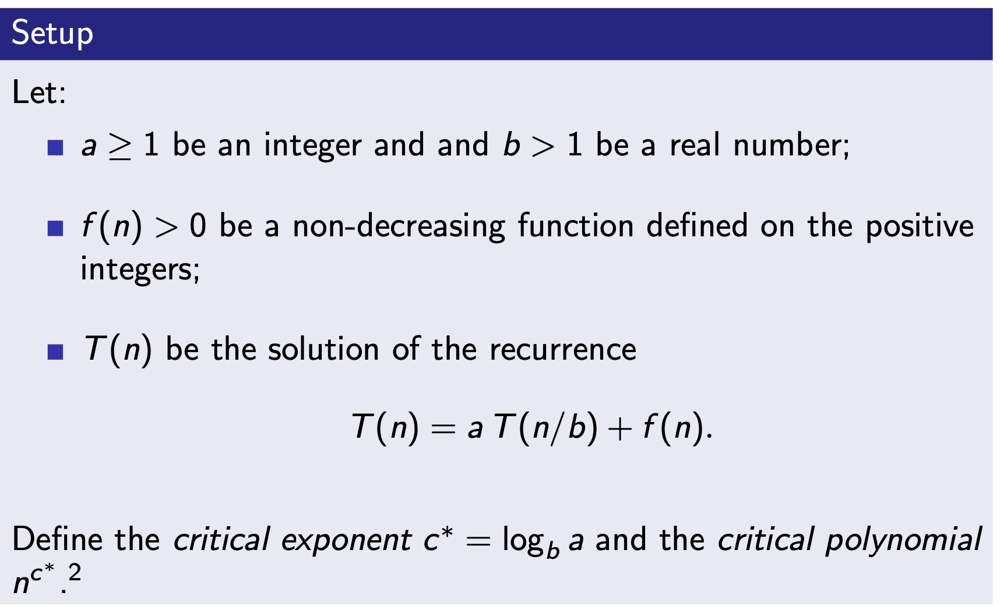  
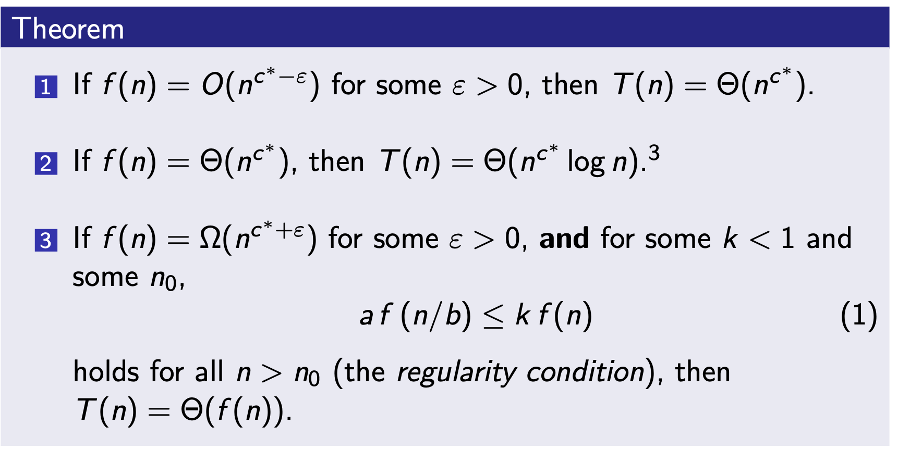  
  

## Master Theorem Examples
### Theorem 1
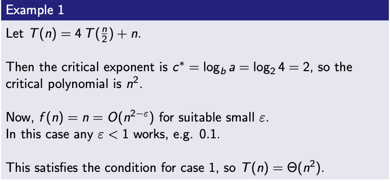  

### Theorem 2
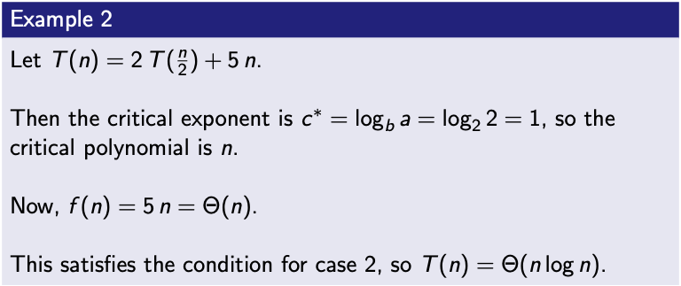  

### Theorem 3
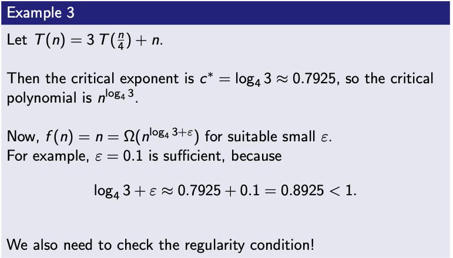  
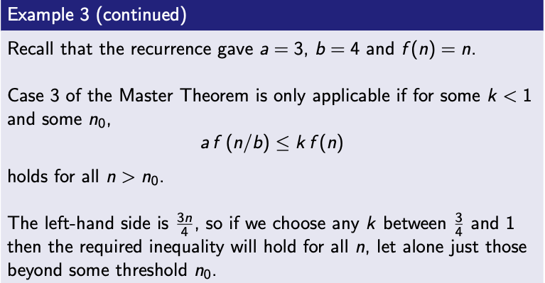  
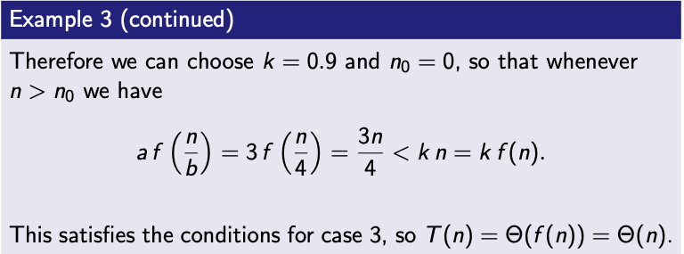  

## Karatsuba Trick
- Multiplying two integer $A$ and $B$
- Split $A$ into $A_1 = \frac{n}{2}$ left bits, $A_0 = \frac{n}{2}$ right bits
- $A$ = $A_1 \times 2^{\frac{n}{2}} + A_0$
  - $\times2^{\frac{n}{2}}$, shifts the bits $\frac{n}{2}$ to left. (think $\times$ 10 in decimal)
- $B$ = $B_1 \times 2^{\frac{n}{2}} + B_0$ (same as above)
- In previous method there are 4 multiplications: $A_1B_1$, $A_1B_0$, $A_0B_1$, $A_0B_0$
- In Karatsuba trick there are 3 multiplcations (saves 1): $A_1B_1$, $(A_1+A_0)(B_1+B_0)$, $A_0B_0$
  
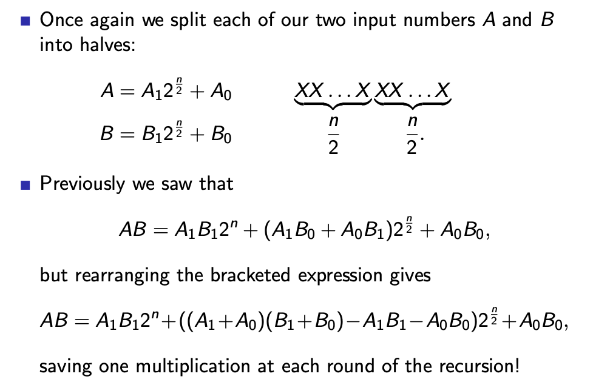  

### Karatsuba Trick Time complexity
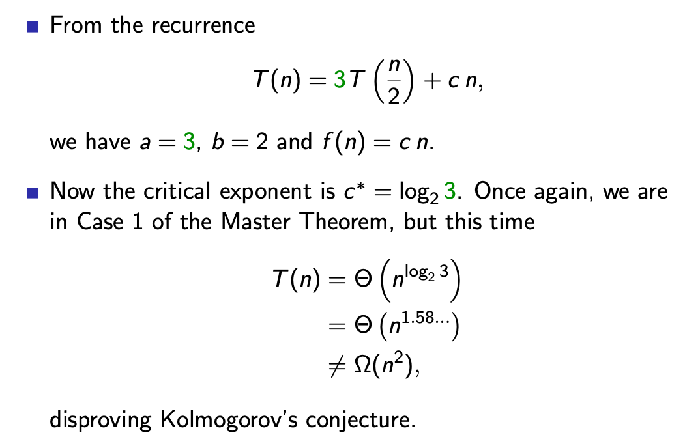  

## Polynomials
### Coefficient Representation
$P(x) = A_nx^n + A_{n-1}x^{n-1} + ... + A_1x+A_0$

- **Addition**: Allows for addition of two polynomials $P_A$ and $P_B$ term by term 
  -  $O(n)$ time 
- **Evaluation**: All terms have a factor of $x$ except $A_0$
  - $P(x) = A_0 + x(A_1 + A_2x + ... + A_{n-1}x^{n-2} + A_nx^{n-1})$ 
  - $P(x) = A_0 + x(A_1 + x(A_2 + x(...)))$
  - Start from middle $A_n$, then multiply by $x$, add $A{n−1}$, multiply by $x$, and so on.
  - $O(n)$ time.
- **Multiplication**: Involves multiplying every $A_iB_j$ pair
  - $(A_nx^n ... + A_1x+A_0)(B_nx^n ... + B_1x+B_0)$
  - $O(mn)$ time

### Polynomial Multiplication
$P(x) = A_nx^n + A_{n-1}x^{n-1} + ... + A_1x+A_0$   
and  
 $P(x) = B_nx^n + B_{n-1}x^{n-1} + ... + B_1x+A_0$

Product will be of degree $2n$

$P_C(x) = C_{2n}x^{2n} + C_{2n-1}x^{2n-1} + ... + C_1x+C_0$

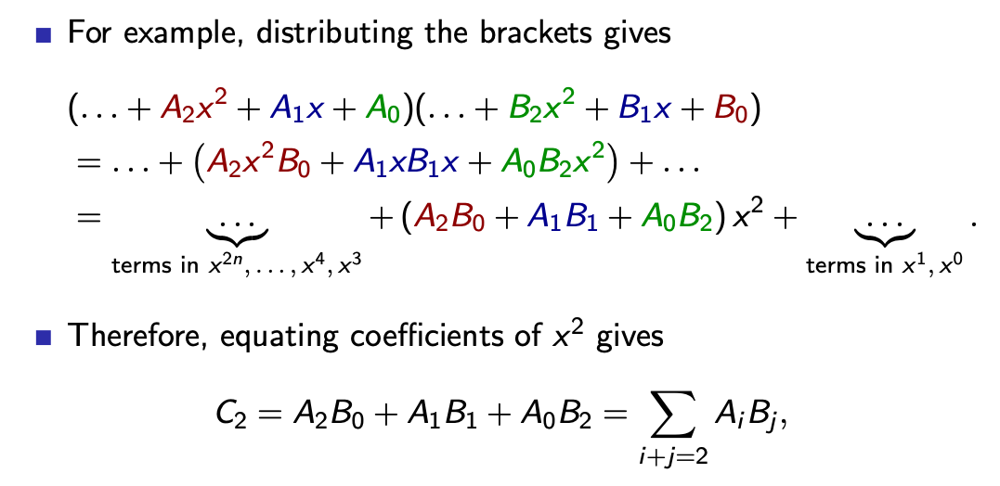  

## Convolution
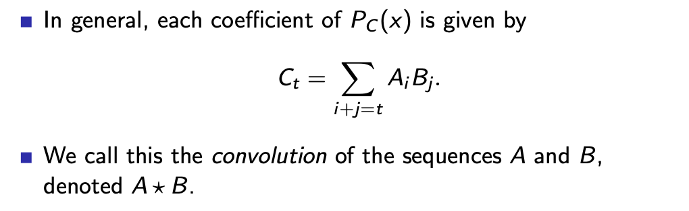  

- Using formula above, product of two polynomials can be computed in $\Theta(n^2)$ time, as there are quadractic many $A_iB_j$ products 

### Visualisation of $A \star B$
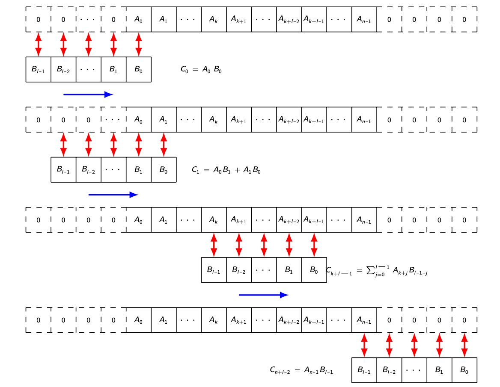 

### Value representation
Represent a polynomial of degree $n$ by a **sequence** of $n + 1$ values.
- Fix a selection of inputs $x_0, . . . , x_n$. Then the corresponding values $P(x_0), . . . , P(x_n)$ represent a unique polynomial of degree up to $n$.

 

- **Addition and Multiplication**: can be executed **pointwise** in linear time:
  - $(P_A + P_B)(x_0) = P_A(x_0) + P_B(x_0)$
  - $(P_AP_B)(x_0) = P_A(x_0)P_B(x_0)$
- **Evaluation**: No straightforward way to evaluate input which isnt in $x_i$

### Converting between coefficient and value

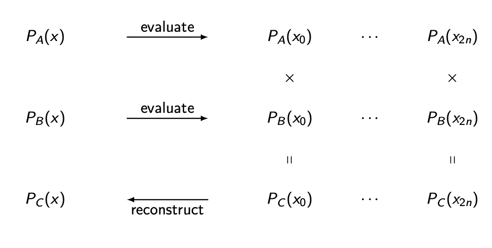   

## Complex root of unity
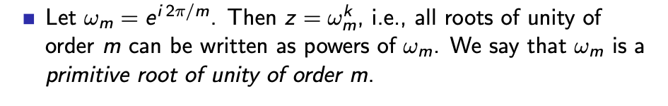  
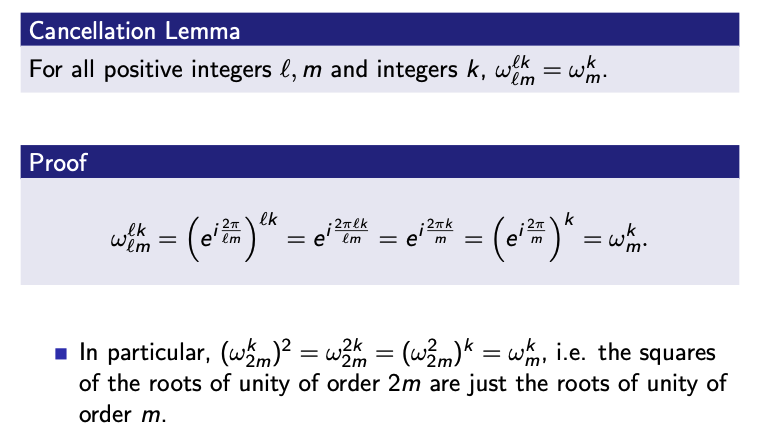  

Example: If $k = 3$, $m = 4$ and $l = 2$,  
$w^k_m$ = $w^3_4$ = $w^6_8$

## Discrete Fourier Transfrom
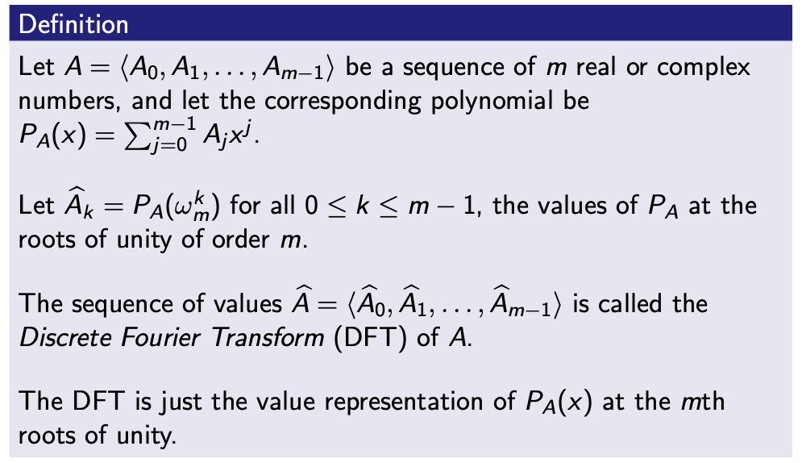  

## Fast Fourier Transform
https://www.youtube.com/watch?v=h7apO7q16V0

**High Level Explanation**  
Example: $S \times V$:
- Use $FFT(S$ and $V) => DFT(S)$ and $DFT(V)$ 
- Multiply $DFT(S)$ and $DFT(V)$ pointwise 
- Use $IFFT$ to get $S \times V$

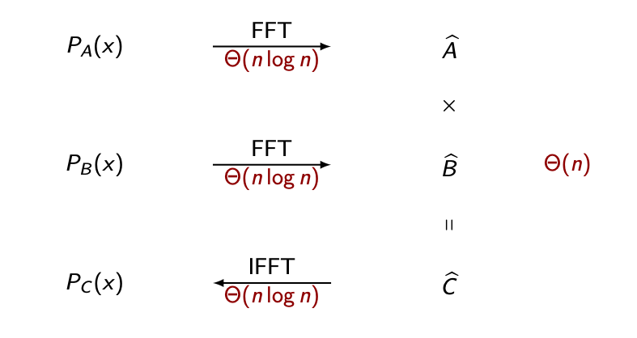  

 

# Greedy Algorithms
A **greedy algorithm** is one that solves a problem by **dividing it into stages** by considering the choice that appears best at that stage.

### Examples
- **Optimal Selection** (Activity Selection, Cell Towers)
- **Optimal Ordering** (Minimising Job Lateness)
- **Optimal Merging** (Huffman Tree)
- **Direced Graph Structure** (Tsunami Warning)

## Direced Graph Structure

### Strongly connected Components
Given a directed graph $G = (V, E)$ and a vertex $v$ , the **strongly connected component** of $G$ containing $v$ consists of all vertices $u ∈ V$ such that there is a **path** in G from $v to u$ and a **path** from $u to v$. This is $C_v$.

- Use **Tarjan’s Algorithm** and **Kosaraju Algorithm** to find strongly connected components in $O(V + E)$ time. 

### Condensation Graphs
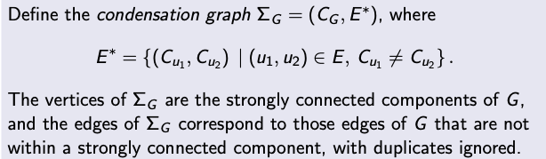

- **Verticies** are strongly connected 
- **Edges** connect different strongly connected components.
- Condensation graphs are **directed acyclic graphs**
  
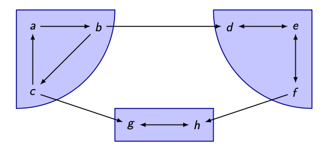   
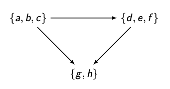   

### Topological Sorting
   

- $O(V + E)$, linear time for a graph

## Single Shortest Paths
**Dijkstra's algorithm's** finds the single shortest path from one node to another.

### Array Implementation
- $n$ linear scans of array of length $n$ --> $O(n^2)$
- check for $m$ edges `d_v + w(v,z) < d_z` --> $O(m)
  - Overall $O(m + n^2)$

### Augmented Heap Implementation
- Heap represented by array $A[1..n]$, where $A[j] = (i, d_i)$
  - Min-heap property on $d$ values
  - Left child at $A[2j]$
  - Right child of $A[2j + 1]$

Since heaps can only get min/max, use second array to store **position** of elements in heap.
- $A[j]$ refers to vertex $i$, so record $P[i] = j$
- So to lookup vertex $i$, $A[P[i]] = (i, d_i)$

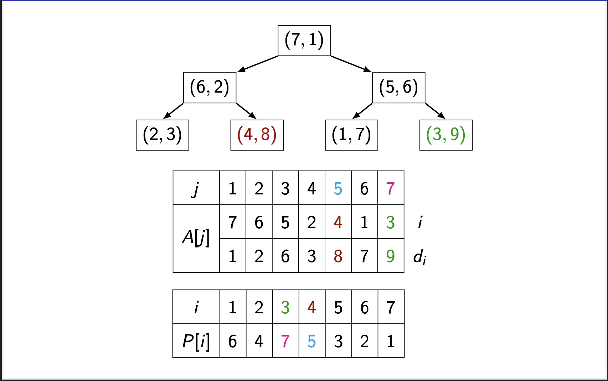  

#### Heap operations
- Updating d-value at vertex $i$ is $O(logn)$
- Accesing top of heap is $O(1)$ and popping from heap is $O(logn)$

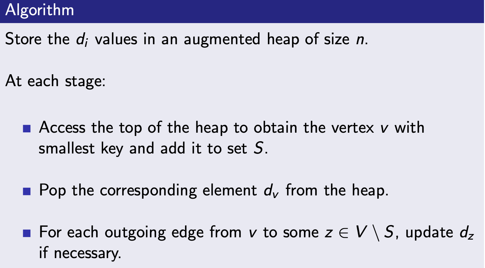  

#### Time Complexity
- Each of $n$ stages requires deletion from heap --> $O(nlogn)$
- Each of $m$ edges causes at most one update in heap --> $O(mlogn)$
- Overall $O((m + n)logn)$, since $m \geq n - 1$ --> $O(mlogn)$

## Minimum spanning trees
A minimum spanning tree $T$ of a connected graph $G$ is a subgraph of $G$ (with the same set of vertices) which is a tree, and among all such trees it **minimises** the total length of all edges in T.

###  Kruskal's Algorithm
- sort the edges $E$ by weight
- add edge $e$ if no cycle, or discard otherwise
- process terminates when forest is connected

### Union-Find
**Union-Find** data structure used to implement Kruskal's algorithm
- `FIND(a)` should find the root of tree containing $a$
- `UNION(a,b)` 
  - do nothing if $a$ and $b$ in same tree 
  - add an **edge** between two trees so they become one tree

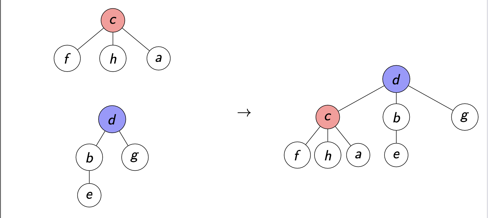  

#### `FIND(a)` steps
- starting at $a$, recursively traverse edge to parent until **root** of tree is found.
- $O(h)$ --> $O(logn)$

#### `UNION(a,b)` steps
- Run `FIND(a)` and `FIND(b)` to identity roots $c, d$
- If $c = d$ do nothing
- Otherwise, place edge between $c, d$
  - If $subtree(c) \geq subtree(d)$, then set $parent(d) = c$
  - If $subtree(d) > subtree(c)$, then set $parent(c) = d$
- $O(h)$ --> $O(logn)$  

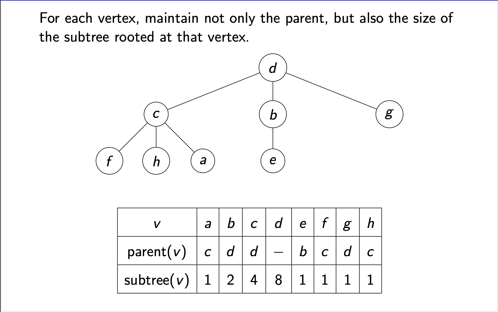  

### Size Heuristic

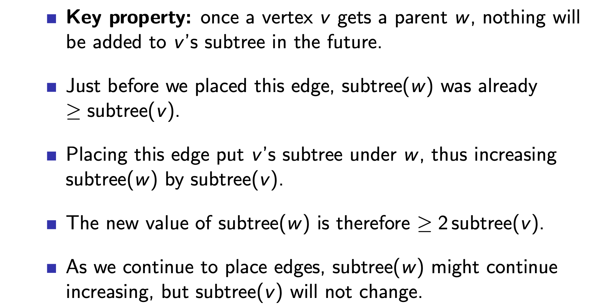  

### Time Complexity of Union-Find
- `FIND(a)` --> $O(logn)$
- `UNION(a,b)` --> $O(logn)$

### Applying Kruskal's using Union-Find

- Algorithm explanation

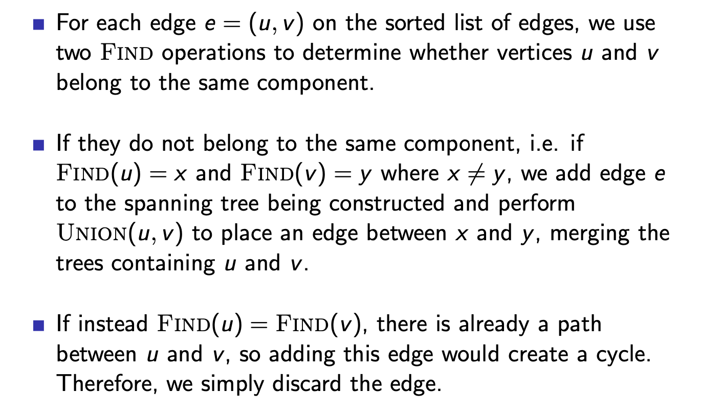  

- Analysing time complexity, overall --> $O(mlogn)$
  
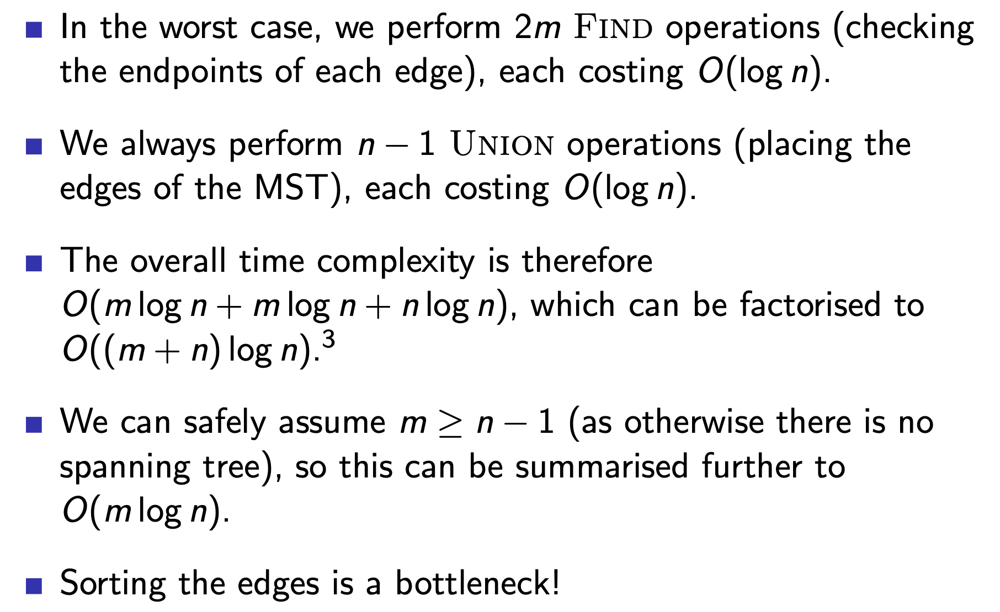  

## Flow Networks
A **flow network** $G = (V, E)$ is a **directed graph** in which each edge $e = (u,v) ∈ E$ has a positive integer **capacity** $c(u,v) > 0$.

There are two distinguished vertices: a source $s$ and a sink $t$.

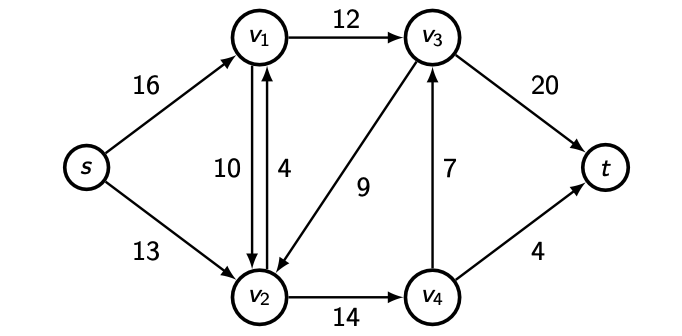  

### Flow
A **flow** in $G$ is a function $f : E → [0, ∞), f (u, v ) ≥ 0$, which satisfies:
1. **Capacity constraint**: for all edges $e = (u,v) ∈ E$ we require  
$f(u,v) ≤ c(u,v)$  
the flow thorugh any edge does not exceed capactiy

1. **Flow conservation**: for all vertices we require the **flow in = flow out** except for **source** and **sink**.

### Value of a flow
The value of a flow is defined as $|f| = f(s, v) = f(v, t)$ ,the flow leaving the source, or equivalently, the flow arriving at the sink.

### Residual Flow
A **residual flow** network is the network made up of the leftover capacities.

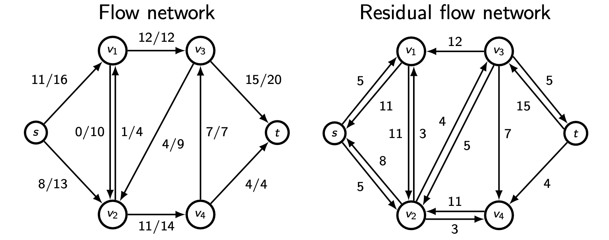  

### Augmenting path
An **augmenting path** is a path from $s$ to $t$ in the **residual flow network**.
- the **capacity** of an augmenting path is the edge of smallest capacity 

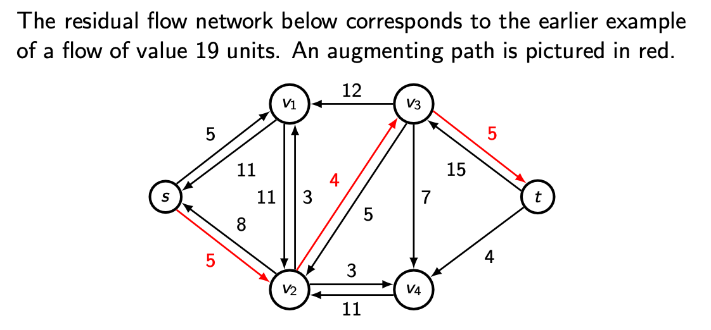  

## Ford-Fulkerson algorithm
- Keep adding flow through **new augmenting paths** for as long as it is possible.
- When **no more augmenting paths**, you have the **largest possible flow in the network**.

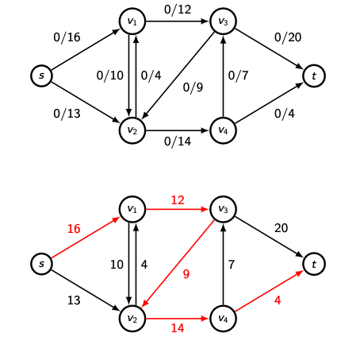  
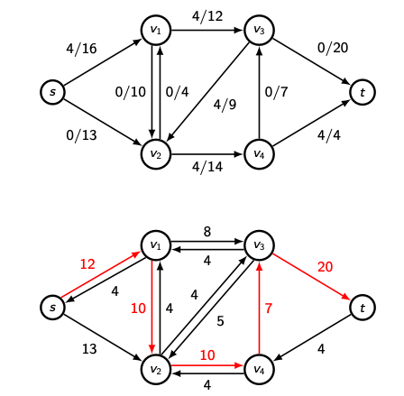  
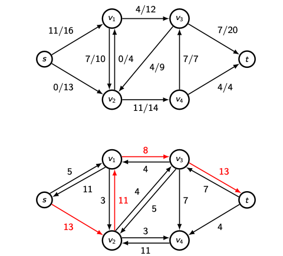  
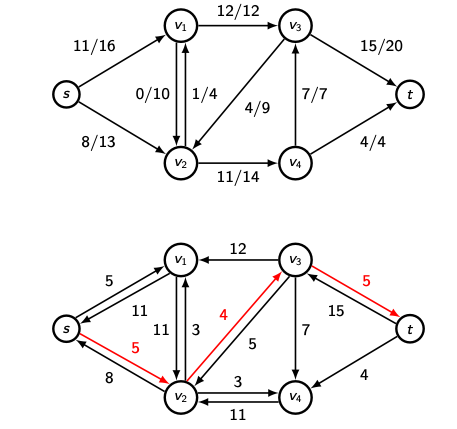  
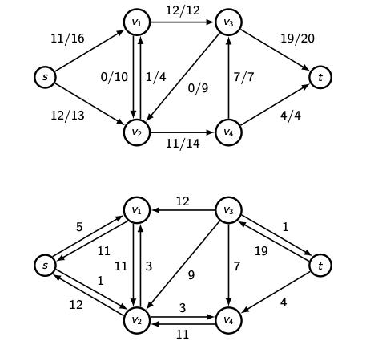  

## Cuts in a flow network
A cut in a flow network is any partition of the vertices of the underlying graph into two subsets S and T such that:
- $S∪T=V$
- $S∩T=∅$
- $s∈S$ and $t∈T$

### Capacity of cuts
The capacity $c(S,T)$ of a cut $(S,T)$ is the sum of capacities of all edges **leaving** $S$ and **entering** $T$
- Edges from T to S, do not count

### Flow through cuts
Given a flow $f$, the flow $f(S,T)$ through a cut $(S,T)$ is the **total flow** through edges from $S$ to $T$ minus the **total flow** through edges from $T$ to $S$

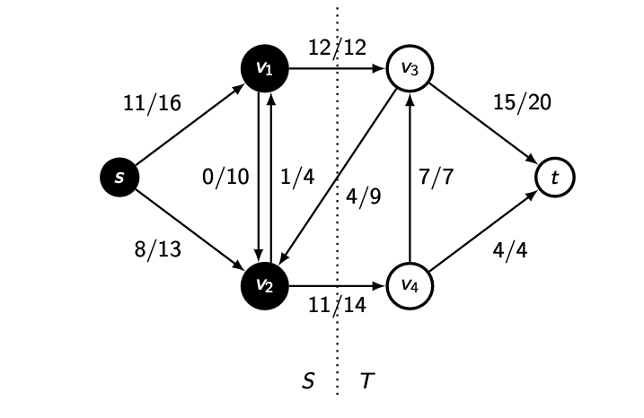  

- Capactiy: $c (S , T ) = c (v1 , v3 ) + c (v2 , v4 )= 12 + 14 = 26.$  
-  Flow: $f(S,T) = f(v1,v3)+f(v2,v4)−f(v2,v3) = 12+11−4 = 19.$

### Max Flow Min Cut Theorem
The **minimum cut** is the cut whose capacity is the smallest among all possible cuts.

The **maximum amount of flow** in a flow network is **equal** to the capacity of the cut of minimum capacity.

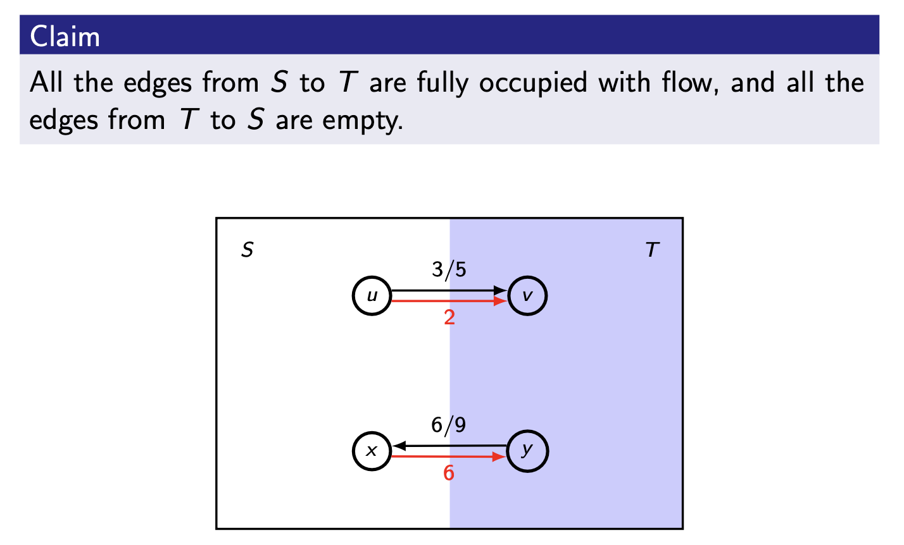  

### Ford-Fulkerson Time complexity
- number of augmenting paths can be up to value of **max flow**, denoted $|f|$.
- augmenting path found in $O (V + E)$ (DFS, BFS). In a sensible flow network $V ≤ E + 1$, so $O(E)$.

Therefore the **time complexity** of the Ford-Fulkerson algorithm is $O(E|f|)$.

## Edmonds-Karp algorithm
Modified Ford-Fulkerson algorithm: **always choose the augmenting path which consists of the fewest edges**.
- find the next augmenting path using breadth-first search in $O(V + E) = O(E)$ time

### Time complexity of Edmonds-Karp algorithm
- number of augmenting paths is $O(VE)$ (don't need to know how)
- each augmenting path found in $O (V + E)$ (DFS, BFS). In a sensible flow network $V ≤ E + 1$, so $O(E)$.
- Thus the time complexity is $O(VE^2)$ or $O(E|f|)$ (Ford-Fulkerson).

## Multiple sources and sinks
Flow networks with **multiple** sources and sinks are reducible to networks with a **single** source and **single** sink.
 - adding a “super-source” and “super-sink” and connecting them to all sources and all sinks respectively.

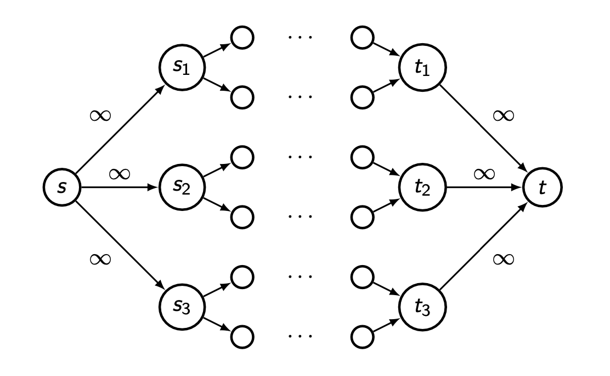  

## Vertex Capacities
Vertices $v_i$ of the flow graph might have capacities $C(v_i)$, which **limits** flow in and out.

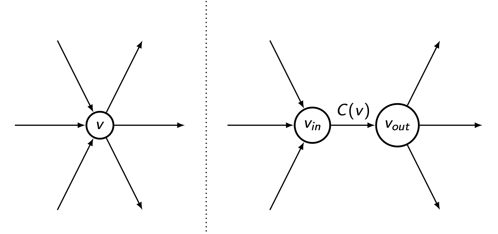  

 

# Dynamic Programming
Dynamic Programming is used to solve a large problem recursively by building from (carefully chosen) **subproblems** of smaller size.
- answers to smaller subproblems can be combined to answer a larger subproblem

## Efficiency
- Divide and Conquer breaks problems into **dijoint** subproblems.
- DP breaks problems into **overlapping** subproblems.

## Parts
- a definition of the **subproblem**
- a **recurrence relation** which determines how the solutions to smaller subproblems are combined to solve a larger subproblem.
- any **base cases**, which are the trivial subproblems - those for which the recurrence is not required.

## Execution
Always talk about DP in a **iterative (bottom-up)** sense:
- start with base case (smallest subproblem)
- gradually increase to solve larger subproblem using recurrence.

Answers to subproblems will be stored in a lookup table.
- array indexed by parameters of subproblem

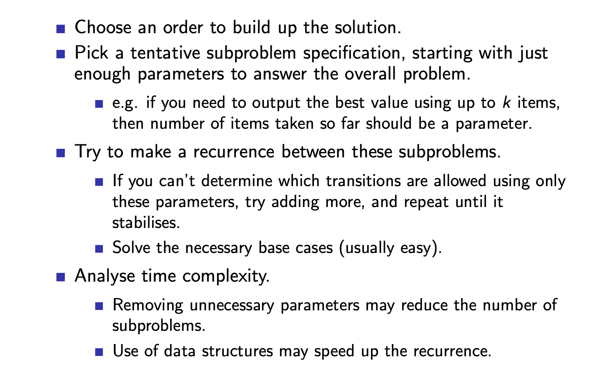  

## Directed acylic graphs (DAG)
Directed acyclic graph (DAG) - a directed graph without (directed) cycles.

### Topologic ordering 
Recall that in a directed graph, a topological ordering of the vertices is one in which all edges point “left to right”.
- direct graph must be acycli to be topologically ordered
- may be more than one topological order
- Time complexity: $O(|V| + |E|)$

## Types of DPS
- One Parameter, Constant recurrence
- One Parameter, Linear recurrence
- Two Parameter, Constant recurrence
- Two Parameter, Linear recurrence

### One Parameter, Constant recurrence
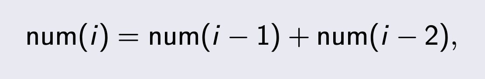  

### One Parameter, Linear recurrence
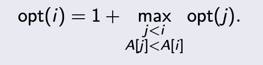  

### Two Parameter, Constant recurrence
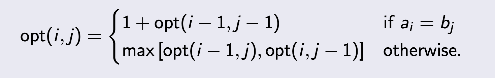  

### Two Parameter, Linear recurrence
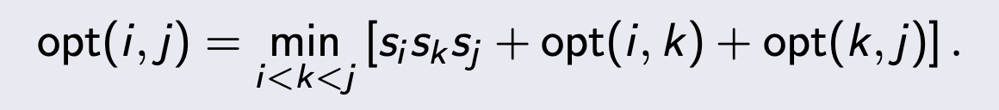  

## Bellman-Ford algorithm (single node)
**Instance:** a directed weighted graph $G = (V, E)$ with edge weights $w(e)$ which can be negative, but **without** cycles of negative total weight, and a designated vertex $s ∈ V$.

**Task:** find the weight of the shortest path **from vertex s to every other vertex t**.

**Solution:** 

For every vertex $t$, find the weight of a shortest $s \rightarrow t$ path consisting of at most $i$ edges, for each $i$ up to $n − 1$.

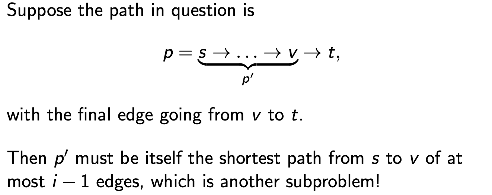  

 

**Algorithm**

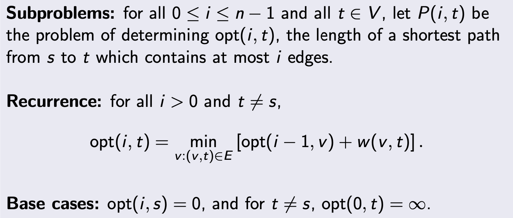  
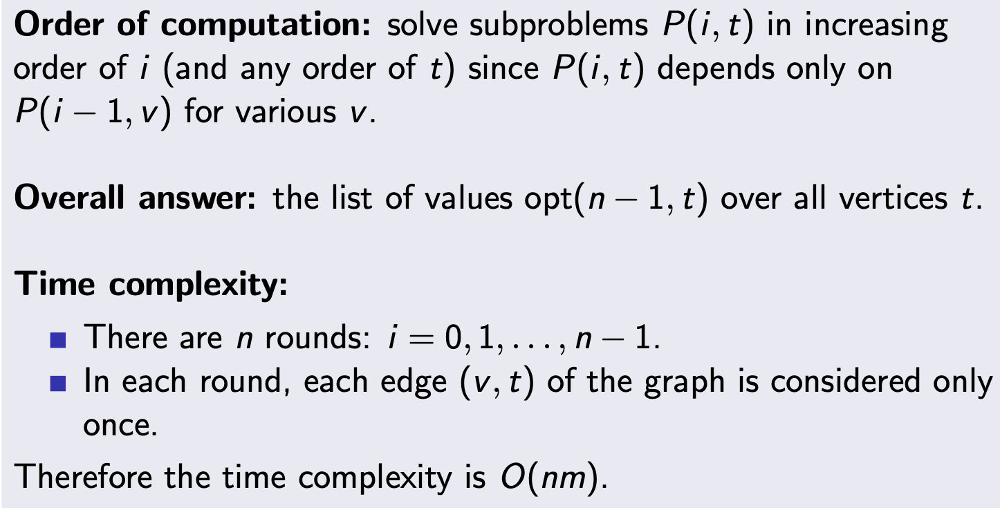  
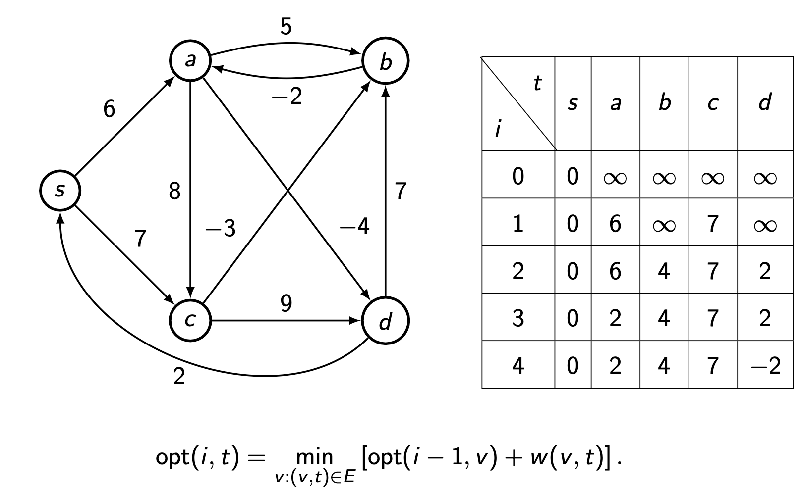  

 

**Path reconstruction**

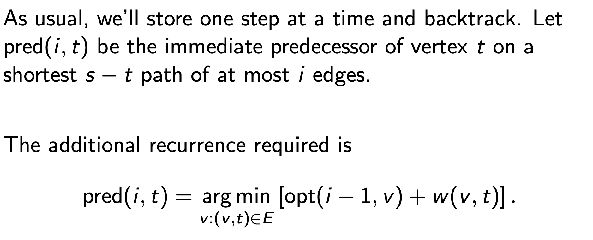  

## Floyd-Warshall algorithm (every node)
**Instance:** a directed weighted graph $G = (V, E)$ with edge weights $w(e)$ which can be negative, but **without** cycles of negative total weight, and a designated vertex $s ∈ V$.

**Task:** find the weight of the shortest path **from every vertex s to every other vertex t**.

**Solution:** 

- Use similar idea to Bellman-Ford in terms of the finding intermediate verticies allowed on an $s \rightarrow t$ path
- Label the verticies of $V$ as $v_1, v_2, ... , v_n$
- Let $S$ be the set of vertices allowed as intermediate vertices. Initially empty, then add $v1, v2, ... , v_n$ one at a time.

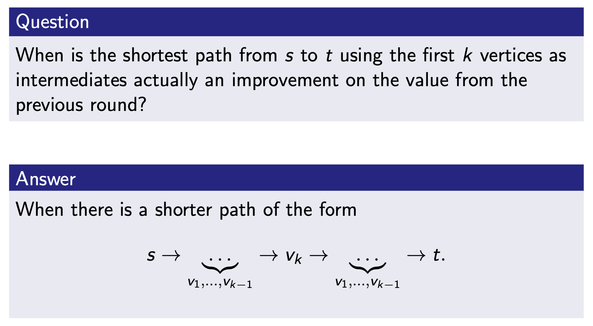  

 

**Algorithm**

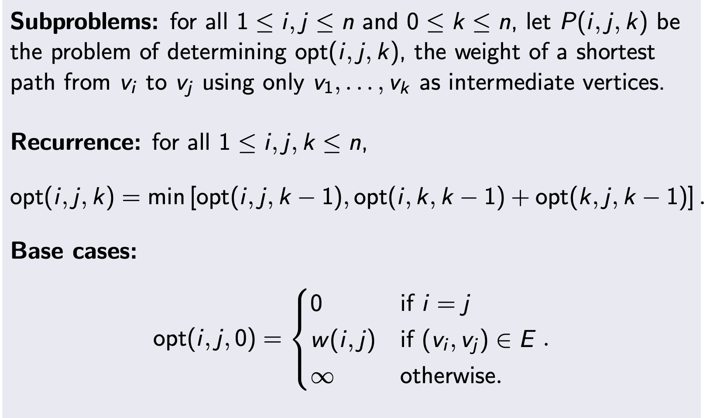  
  

## Applications to String Matching
 **Problem**: Determine whether a string $B = b_1b_2 . . . b_m$ (the pattern) appears as a (contiguous) substring of a much longer string $A = a_1a_2 . . . a_n$ (the text).

### Rabin-Karp Algorithm
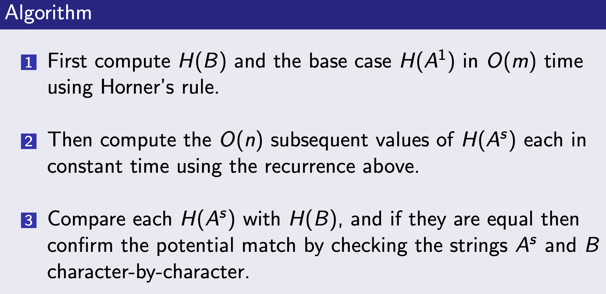  
  

**Example**:
https://www.youtube.com/watch?v=qQ8vS2btsxI 

### Knuth-Morris-Pratt Algorithm

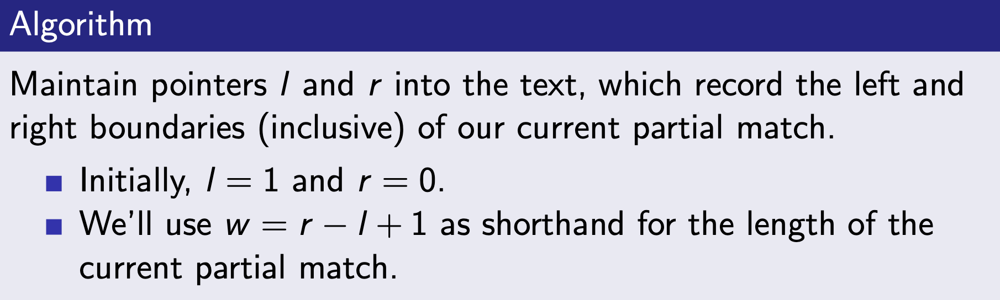  
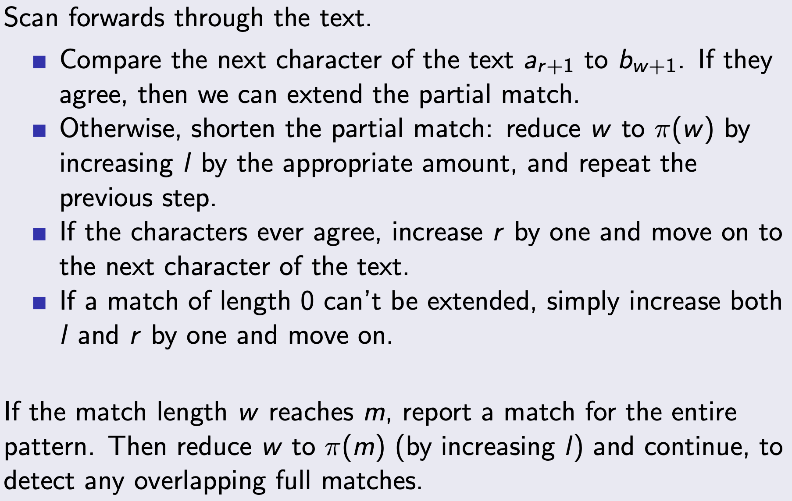  

**Note**: 
- Algorithm in lectures use a **sliding window** approach on the **text** and shortens the partial match using the failure function on the text. 

- Video below uses a single pointer approach on the text and the failure function on the pattern.

**Example:**  https://www.youtube.com/watch?v=V5-7GzOfADQ

# Intracable Problems

## Polynomial Time Algorithms
A (sequential) algorithm is said to be **polynomial** time if for every input it terminates in polynomially many steps in the length of the input.

- Suppose length of input is $n$, this means worst case time complexity satisfies $T(n) = O(n^k)$ for some integer $k$.

Example:   
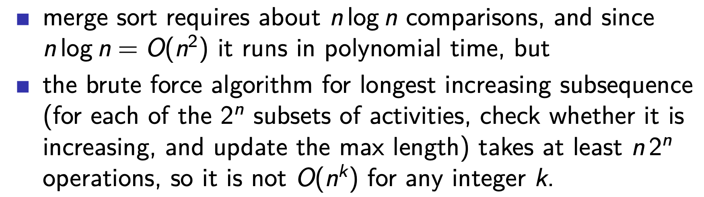  

## Decision Problems and Class $P$
A decision problem is a problem with a YES or NO answer.
- decision problem $A(x)$ is in class $P$ ($A \in P$) if there exists a polynomial time algorithm which **solves** it.

### Satisfiability (SAT)
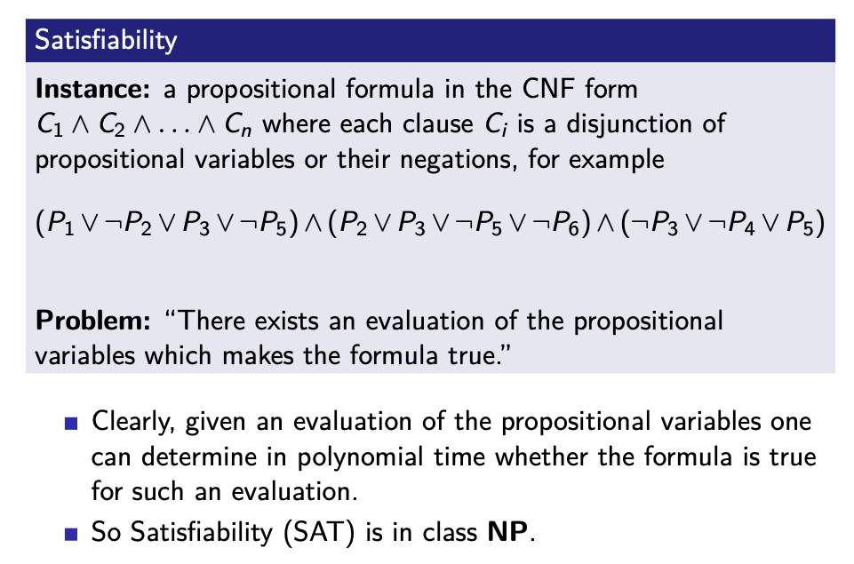  
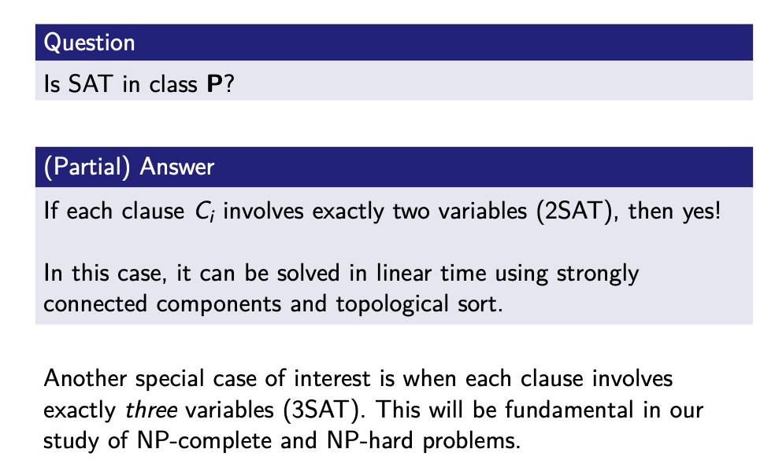  

## Decision Problems and Class $NP$
A decision problem $A(x)$ is in class $NP$ (non-deterministic polynomial time, denoted $A ∈ NP$) if there is a problem $B(x, y)$ such that
- for every input $x$, $A(x)$ is true if and only if there is some $y$ for which $B(x, y)$ is true
- the truth of $B(x, y)$ can be **verified** by an algorithm running in polynomial time in the length of x only.

## Reductions
Mapping a new problem back to an old problem that we **already** know how to solve.

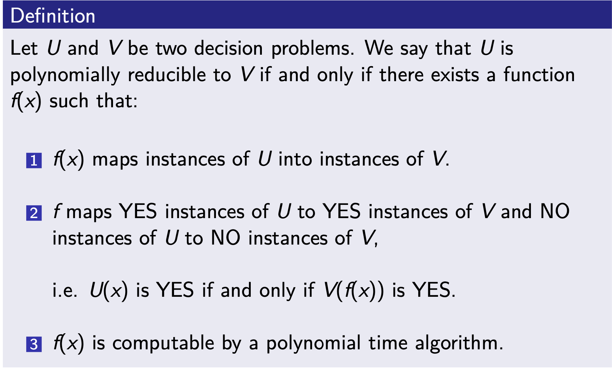  

**Note:** A mapping between two problems doesn’t necessarily mean that the problems are equivalent.

- If there is a polynomial reduction from $U$ to $V$, we can conclude that $U$ **is no harder than** $V$.
- If you could solve problem V in polynomial time, then problem U would also have a polynomial time solution.

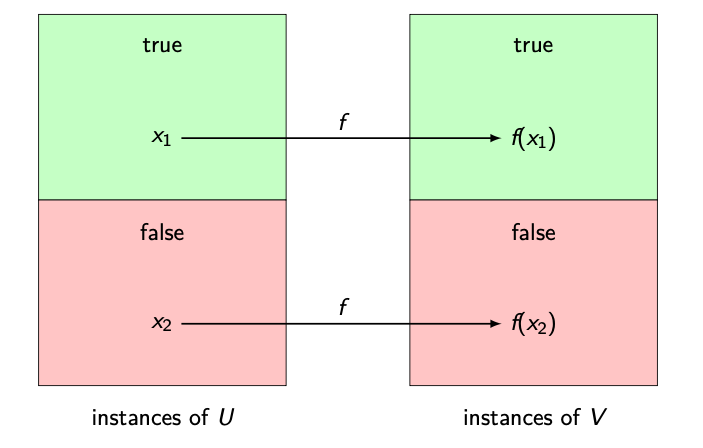  

### Reduction Contrapositives
if there is no (known) polynomial time algorithm for $U$, then there also can’t be a (known) polynomial time algorithm for $V$.

## Cook's Theorem
**Every NP problem is polynomially reducible to the SAT problem.**

This means that for every $NP$ decision problem $U$ there is a polynomial time computable function $f$ such that:
- for every instance $x$ of $U$, $f(x)$ is a valid propositional formula for the SAT problem
- $U(x)$ is true if and only if the formula $f(x)$ is satisfiable.

## NP-Hard
A decision problem $V$ is **NP-hard** $(V ∈ NP-H)$ if every other **NP** problem is polynomially reducible to $V$.
- Hardest problems in **NP** (example: SAT is NP-hard)
- An **NP-hard** problem **might not** be in class NP itself! 
  - Example: halting problem is one example.

## NP-Complete
A decision problem is **NP-complete** $(U ∈ NP-C)$ if it is in class **NP** and class **NP-H**.
- **SAT** is in **NP**, and from Cook’s theorem it is also **NP-hard**, so it is **NP-complete**.
- A polynomial time algorithm for any **NP-complete** problem would imply that **P = NP**.

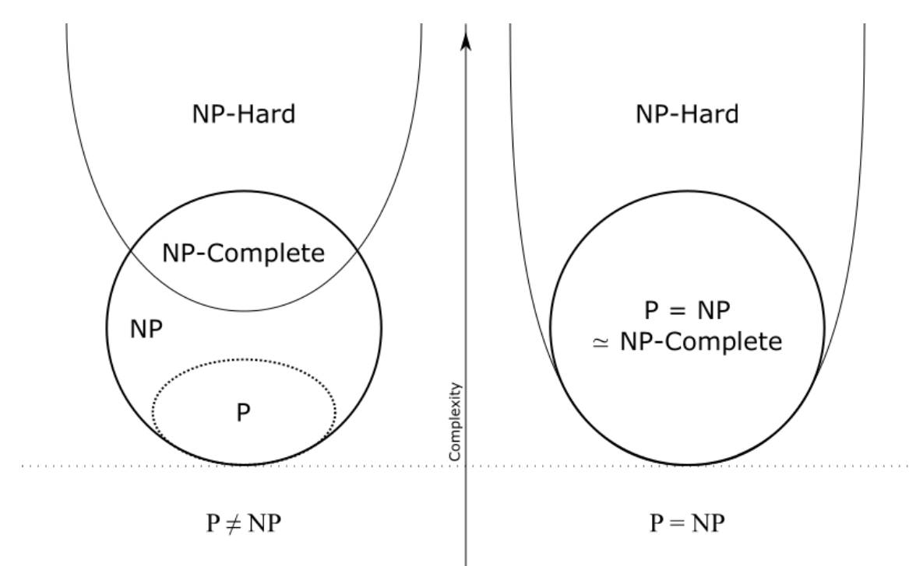  

### Proving NP-completeness
Let $V$ be an **NP-complete** problem, and let $W$ be another **NP** problem. If $V$ is polynomially reducible to $W$, then $W$ is also **NP-complete**.

## Linear Programming
The restrictions (constraints) and cost (objective function) deal only with linear functions of the variables.
- There are **polynomial time algorithms** for linear programming, such as the ellipsoid algorithm.

**Example:**

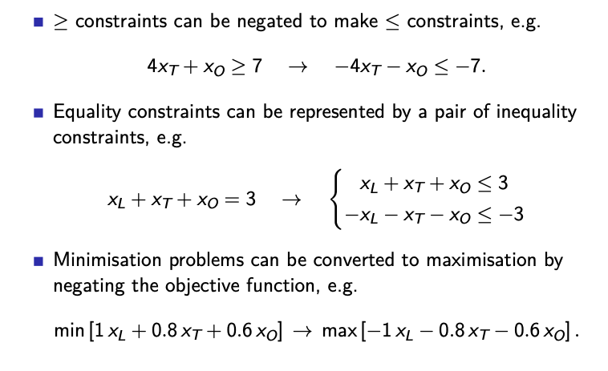  

## Integer Linear Programming
Integer linear programming is actually **much harder** than linear programming with only real-valued variables

- There is **no known polynomial-time** algorithm for integer linear programming.