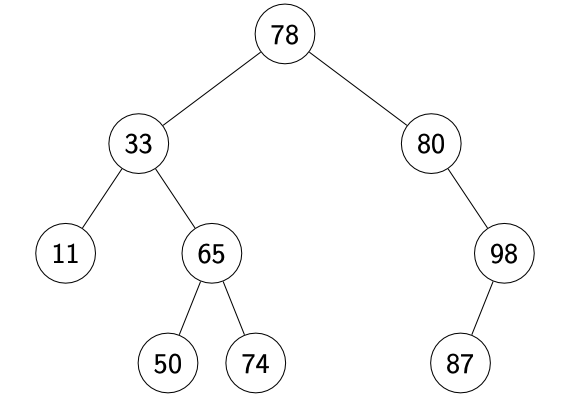

# 3121 Notes

## General Info

**Lecturer**: Aleksandar Ignjatovic  
**Course email**: cs3121@cse.unsw.edu.au  
**Lab tutorial times**: https://timetable.unsw.edu.au/2024/COMP3121.html#S2S

https://www.bigocheatsheet.com/  
https://haezera.github.io/#/resources

### Modules
1. Foundations (week 1)
2. Divide and conquer (week 2 - 3)
3. Greedy algorithms (weeks 4 – 5)
4. Flow networks (week 5 - 7)
5. Dynamic programming (weeks 7 – 9)
6. Intractable problems (weeks 9 – 10)

## Algorithms
An algorithm is a **sequence of precisely defined steps** that can be executed mechanically.

**Sequential Algorithms**
- Comprised by a sequence of steps, which can only be **executed one at a time.**

**Deterministic Algorithms**
- Each step always gives the same result for the same input

## Efficiency 
Measure the efficiency of algorithms using **asymptotic analysis**.
- we are concerned with the **worst case** performance, however average performance sometimes accepted (quicksort)

### Big-Oh
$f(n) = O(g(n))$ if for large enough $n$, $f(n)$ is at most a constant multiple of $g(n)$.

- $g(n)$ is said to be an asymptotic upper bound for $f(n)$

### Big-Omega
$f(n) = Ω(g(n))$ if for large enough $n$, $f(n)$ is at least a constant multiple of $g(n)$.

- $g(n)$ is said to be an asymptotic lower bound for $f(n)$

### Big-Theta
$f(n) = Θ(g(n))$ if $f(n)$ is equal to $g(n)$.
- Only true if $f(n) = O(g(n))$ and $f(n) = Ω(g(n))$.

### Summary

### Sum property 
If $f_1 = O(g_1)$ and $f_2 = O(g_2)$, then $f_1 + f_2 = O(g_1+g_2)$

### Product property
If $f_1 = O(g_1)$ and $f_2 = O(g_2)$ ,then $f_1 \cdot f_2 = O(g_1 \cdot g_2)$

## (Binary) Heaps
- Max heap, parent $\geq$ children
- Min heap, parent $\leq$ children
- Used to implement priority queue

#### Performance
- Build heap: $O(n)$
- Find maximum: $O(1)$
- Delete maximum: $O(log n)$
- Insert: $O(log n)$

Parent at index `i`, children index `2i, 2i + 1`

## Binary Search Tree
Each node’s value $\geq$ all values in left subtree, and $\leq$ all keys in right subtree.

#### Performance
Let h be the height of tree
- Build heap: $O(h)$
- Insert/delete: $O(h)$

### Self Balancing BST
- Perform rotations to ensure $h = O(log(n))$
- All operations:  $O(log(n))$

## Hash Tables
- Store **values** indexed by **keys**.
- Hash function maps keys to indices in a fixed size table.
- Ideally no two keys map to the same index.

#### Performance (expected)
- Search for value associated to key: $O(1)$
- Update value associated to key: $O(1)$
- Insert/delete: $O(1)$
  
#### Performance (worst case)
- Search for value associated to key: $O(n)$
- Update value associated to key: $O(n)$
- Insert/delete: $O(n)$

## Reasoning about algorithms
Whenever we present an algorithm, we must justify its **correctness** and **efficiency**.

## Gale-Shapley algorithm
**1-foundation-short.pdf**:  slides 40 - 55

- The algorithm terminates after $\leq n_2$ rounds.
- The algorithm produces a perfect matching, everyone belongs to exactly one pair.
- The matching produced by the algorithm is stable.

